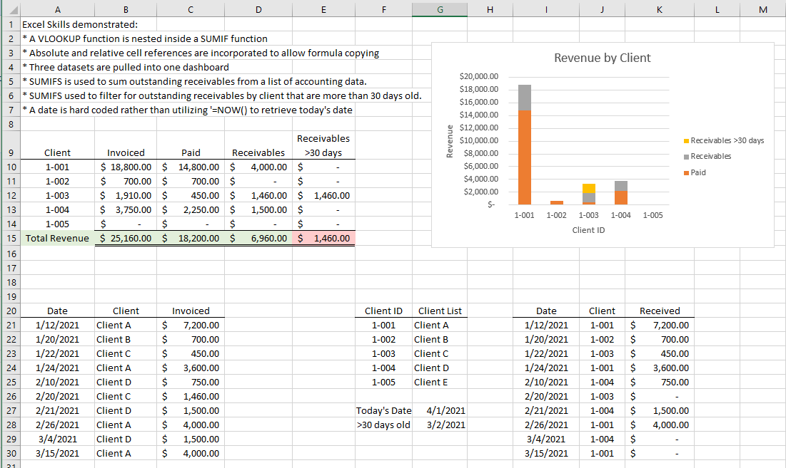
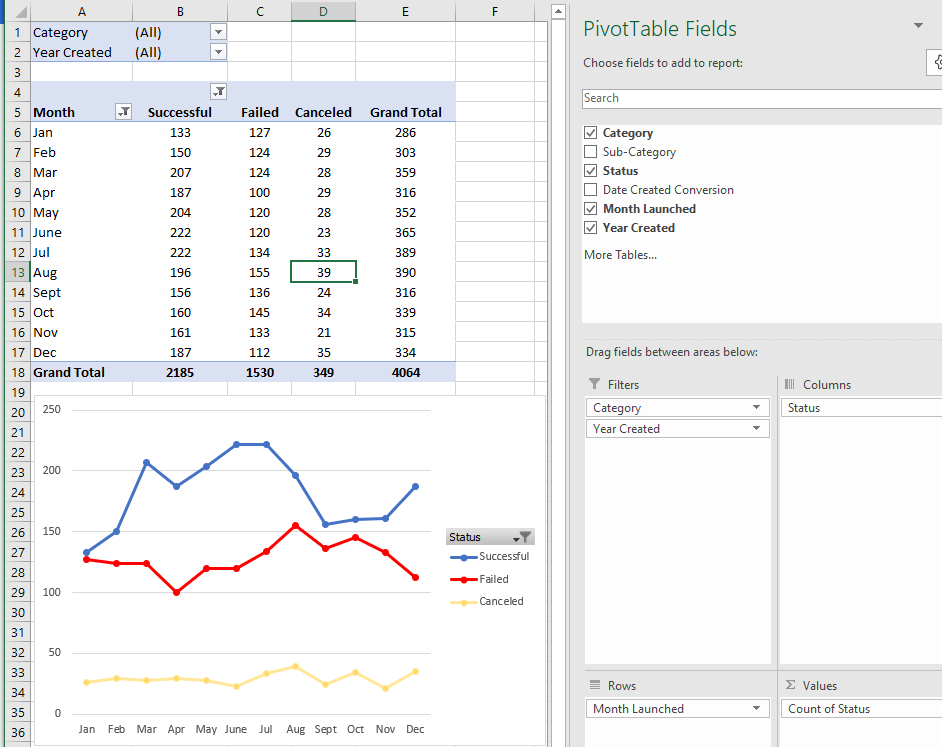
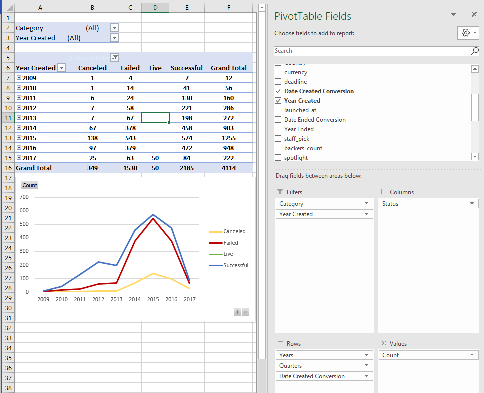
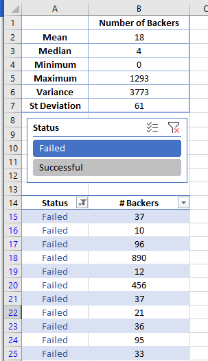
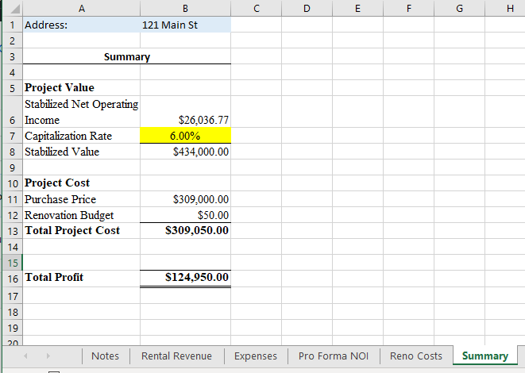

# Under Construction
Basic Excel projects, e.g. pivots, a multi-sheet real estate pro forma workbook, and a SUMIFS-SUMIF-VLOOKUP Revenue sheet.
<html>

            
<body>

The repository contains several workbooks that demonstrate basic Excel skills.

The first is a worksheet with two datasets and a lookup table. The skills demonstrated:
* A VLOOKUP function is nested inside a SUMIF function
* Absolute and relative cell references are incorporated to allow formula copying
* Three datasets are pulled into one dashboard
* SUMIFS is used to sum outstanding receivables from a list of accounting data.
* SUMIFS used to filter for outstanding receivables by client that are more than 30 days old.
* A date is hard coded rather than utilizing '=NOW() to retrieve today's date

  

 

  
  

  

  
  

  

To view the PivotTable sheet: [PivotTable](Pivots.xlsx) 
To view the RE Pro Forma: [RE ProForma](MultiSheet.xlsx) 
To view the SUMIFS-SUMIF-VLOOKUP: [SUMIFS-SUMIF-VLOOKUP](SUMIF-SUMIFS-VLOOKUP) 

 

</body>
</html>
